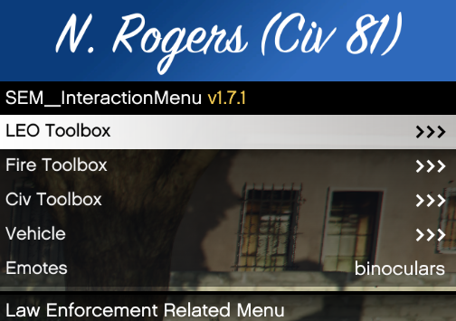

<h1>Menus you will encounter</h1>

<h2>F5 Menu</h2>

<h3>This is where you will make your character, vehicles as well as adjust your voice chat settings</h3>

<h2>M Menu</h2>

<h3>This menu is used for civilian actions ie: Hands up, Hands up kneel</h3>

<h2>Props Menu</h2>

<h3>You can access this by pressing " Y "</h3>

<h3>This Menu is where props are spawned and speed zones set</h3>

<h2>Emote Menu</h2>

<h3>You can access this by pressing " F9 " or typing "Emotemenu" in chat</h3>

<h3>This is where all emotes are stored and accessed</h3>